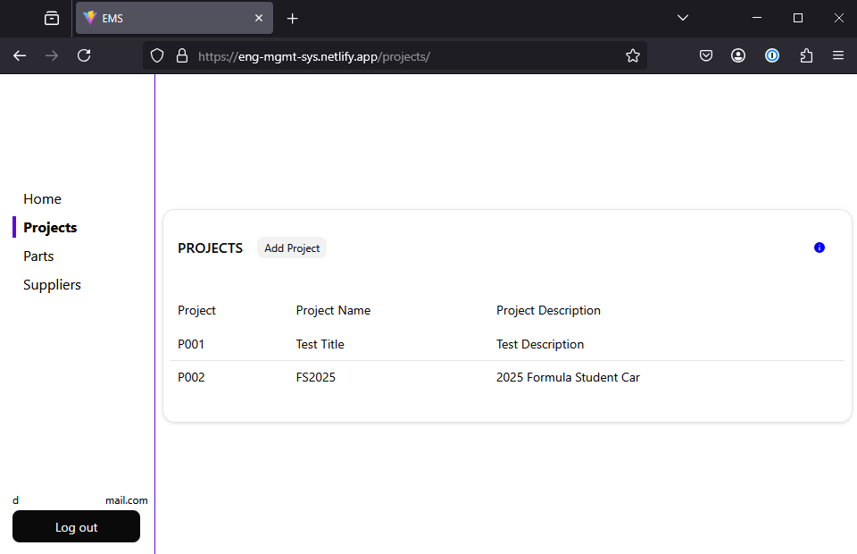
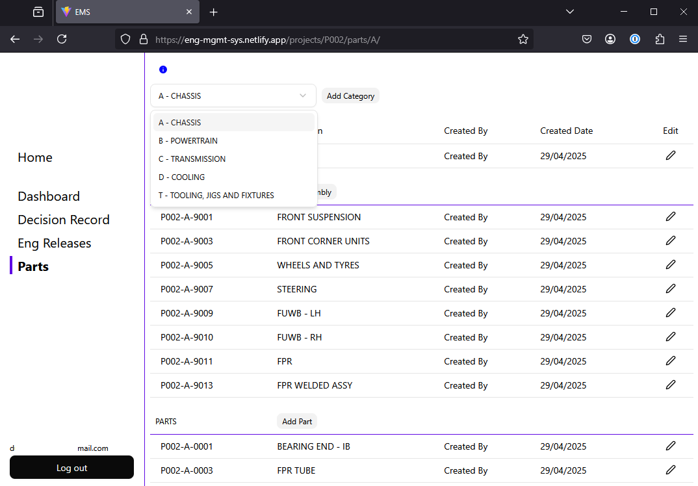
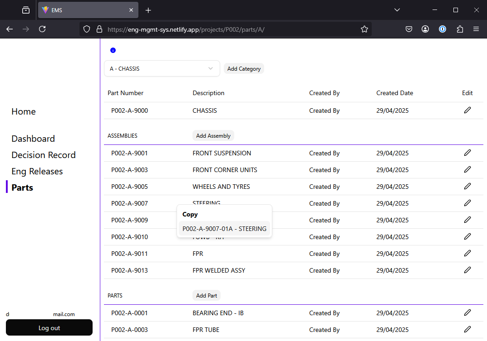

# Engineering Management System

## Link to Hosted Site

https://eng-mgmt-sys.netlify.app/login/

## Overview

This project was created to condense several separate processes and manual entry tasks routinely performed by mechanical engineers.

The project has been built using Vite, React, Typescript and Tailwind for the front end. Tanstack Router and Query are used for routing and data fetching. Supabase provides user authentication, DB and bucket storage. The site layout was developed using Tailwinds mobile first approach.

## Future Work

This site has been created and hosted as a portfolio piece. There are a lot of obvious improvements I'm aware of, along with features I wanted to add which haven't been developed. I have diverted time and attention to other work, however, if I were to continue developing this site, I'd initially focus on the following topics:

<ul>
  <li>Breadcrumb navigation
    <ul>
      <li>User feedback suggests location awareness could be improved.</li>
    </ul>
  </li>
  <li>Project Info Tracking
    <ul>
      <li>CAD PDM systems can export CSVs for any part or BOM level. It would be useful to regularly export full BOM data to track overall mass, lead times and cost.</li>
    </ul>
  </li>
  <li>Engineering Release Page
    <ul>
      <li>Collect more information like supplier and cost code.</li>
      <li>Create sign off workflow so everyone can see the release status:  (Created, Submitted, Eng Sign off, Purchasing Sign off, Complete).</li>
    </ul>
  </li>
  <li>Decision Records
    <ul>
      <li>Implement a lightweight decision record workflow.</li>
    </ul>
  </li>
  <li>General
    <ul>
      <li>Fix general styling and layout inconsistencies. </li>
    </ul>
  </li>
</ul>

## Main Site Pages

Feel free to create an account and trial the site. If you want to follow the suggested workflow, click on the blue Info icons and follow the instructions.
Black Info icons explain more about the section they're associated with.

### Login Page

Login with an email and password or using a Google account.

### Home Page

The home page displays a dashboard showing the most recent projects the user has worked on, along with releases and open issues which are relevant to them.

### Projects Page

This page displays the current projects within the company. Clicking on the project number takes the user to the specific project area.

### Parts Page

This provides a list of parts associated to the company, providing a quick way of filtering. Clicking on the part number takes you a page specific to the part.

### Supplier Page

A page displaying suppliers who have been used before, what their capabilities are and their internal approval rating. Clicking on the map icon opens Google Maps to their location.  
At the moment the table is generated based on static data. During the engineering work flow, parts are released to different suppliers. With further development, engineers, buyers and PMs will be able to provide ratings against each supplier for each release, creating a dynamic, traceable score and history for the business to view. This aids internal supplier nomination for future projects.

## Project Pages

### Dashboard

The project dashboard gives an overview of key metrics.  
The ETRS tracker shows the engineering release cadence based on part lead times, clearly highlighting deadlines and areas where the business will be heavily resourced with part ordering, inspection and stocking ahead of build.  
The Release Overview provides a snapshot of the most time critical releases to draw attention to them.

### Decision Record

As a project progresses, key decisions are discussed and agreed on. At critical points, these decisions can be logged on this page against each project. Implementation for this feature is still required.

### Engineering Release

When component design is complete, an engineering release is required to inform the rest of the business to procure the part and if needed, what to do with previous stock. On this page, new releases can be taken out against the project. Clicking on the release number takes the user to the individual release page.

One of the key features of the release page is the ability to drag and drop CSV files generated by the CAD PDM system. Previously, each release required an engineer to manually re type all of the part information including number, description, quantity etc. If 1000's of parts require release, this is a significant time sink prone to manual error. Exporting a CSV from the software and uploading it takes several seconds in total with no errors.  
Files associated to the release like quotes and invoices can be uploaded and are stored in an S3 bucket. This ensures the history is saved and is accessible in future to anyone in the business rather than being lost in someones inbox.

### Parts

Every time a new part is required, the first step is to take out a new, unique part number. Before, this process was controlled by a shared excel file, with one file for each project. An engineer would have to open the sheet and take out the next row, while having to assume the sheet was sync'd and up to date with other users. This page makes assigning new sub categories, assemblies and parts extremely straight forward.

Once a new part has been created, the user can right click on the table row for the option to quickly copy the new part number pre formatted as required by the CAD PLM software.

